# Finch architecture — draft

Rough first pass, styled after the boxes/arrows/color-coded pattern. Meant to
be refined further (e.g. in Claude on the web) before going in the README or
a submission asset.

```mermaid
flowchart TD
    subgraph humans["👤 Human / Judge"]
        TG[Telegram bot<br/>@FinchRH_bot]
    end

    subgraph agents["🤖 Agent"]
        MCP[MCP client<br/>Claude / Cursor]
        BAZ_CALLER[Any x402 agent]
    end

    subgraph app["Application layer"]
        BOT[bot/src/index.ts<br/>Telegram + button UI]
        API[bot/src/http.ts<br/>HTTP API]
        MCPSRV[bot/src/mcp.ts<br/>MCP server]
    end

    subgraph gateway["Bazantic — metered access"]
        BAZ[x402/MPP Gateway<br/>Finch]
        RECIPE[Recipe: FINCH_GRAPH_ENS<br/>finchQuery → ensResolve]
    end

    subgraph pipeline["Data pipeline — live, The Graph"]
        SS[Substreams module<br/>StreamingFast + thegraph.market]
        PG[(Postgres · Aiven)]
    end

    subgraph verify["On-chain verification — Robinhood Chain"]
        PM[Uniswap V4 PoolManager<br/>+ Meme Hook filter]
        HFM[PonsHolderFeeManager<br/>distributorOf&#40;&#41; cross-check]
    end

    subgraph ens["The Graph — ENS subgraph (mainnet)"]
        ENS[Reverse resolve<br/>0x → .eth]
    end

    subgraph settle["Base — x402 settlement"]
        TX[USDC transfer<br/>verified via /x402/verify]
    end

    TG --> BOT
    MCP --> MCPSRV
    BAZ_CALLER -->|pay per call| BAZ
    BAZ --> API
    BAZ --> RECIPE
    RECIPE --> API
    RECIPE --> ENS

    BOT --> API
    MCPSRV --> API
    API --> PG
    SS -->|sink postgres| PG
    API -->|token/quoteToken reads| PM
    API -->|distributorOf&#40;&#41;| HFM
    BAZ -.->|settles| TX

    classDef live fill:#dbeafe,stroke:#2563eb,color:#1e3a8a;
    classDef verify fill:#fef3c7,stroke:#b45309,color:#78350f;
    classDef gateway fill:#dcfce7,stroke:#15803d,color:#14532d;
    class SS,PG live
    class PM,HFM,TX verify
    class BAZ,RECIPE gateway
```

## Notes for the next pass

- Color scheme to consider (matching the fuda example): blue = "source of
  truth, verified independently" (on-chain reads + Base settlement), amber =
  "off-chain but attested against something verifiable" (Substreams/Postgres
  — live, but not itself on-chain), green = metering/access layer (Bazantic).
- Could split into two diagrams like the reference: one for "how a human/agent
  reaches Finch" (top half) and one for "how Finch proves what it says" (the
  on-chain verification half) — might read cleaner separated.
- Missing from this draft: the hourly prune job, the ~150k-block sink window
  — probably a footnote, not a diagram box.
